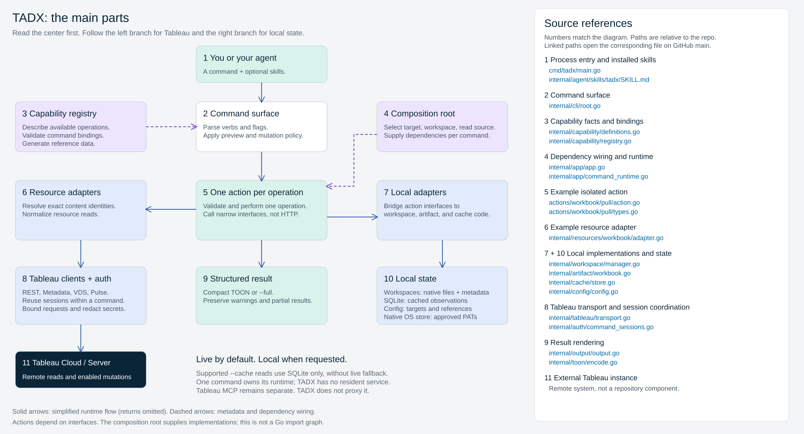

# TADX architecture

TADX is one CLI binary, not a resident service.
The diagram separates command handling, operation rules, remote adapters, local state, and rendering.

Open [the editable Excalidraw diagram](tadx-architecture.excalidraw) in Excalidraw to zoom, edit, or follow the numbered source links.
The side legend points to concrete files rather than listing every command inside the boxes.
Solid arrows summarize runtime flow; dashed arrows show registry and dependency wiring.
Actions depend on narrow interfaces, not the concrete adapters shown beside them.

The [package reference](../repository-structure.md) describes the current source layout.
The [capability map](../reference/capability-map.html) answers a different question: which operations TADX provides.
The [preserved HTML overview](index.html) also includes a workbook-pull walkthrough.
Open either HTML file in a browser; GitHub displays its source rather than running the page.
